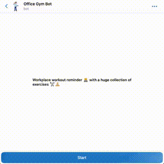

# 📆 Telegram Scheduler WebApp 

Set a fitness schedule from a Telegram WebApp for [@OfficeGymBot][tg-ogb-link].

![][mit-badge] * [![][tg-ogb-badge]][tg-ogb-link] * [![][web-ogb-badge]][web-ogb-link] * ![][used-badge]

[mit-badge]: https://img.shields.io/badge/license-MIT-lightgreen
[tg-ogb-badge]: https://img.shields.io/badge/try-telegram-blue?logo=telegram&logoColor=white
[tg-ogb-link]: https://t.me/officegymbot
[web-ogb-badge]: https://img.shields.io/badge/try-web-yellow?logoColor=white
[web-ogb-link]: https://office-gym-bot.website.yandexcloud.net
[used-badge]: https://img.shields.io/badge/activated-%3E%203k%20times-green?logo=telegram&logoColor=white

<div align="center">
  
</div>

---

## 📱 Features 
- set training days of week and time 💪
- auto timezone detection 🗺️
- dark and light modes 🚥
- python bot to test the integration 🤖
- automated S3 deployment 🚀

<div align="center">
  
  
</div>

## ⌨️ Usage

### Prereqs
- [build] npm
- [test] ngrok, python3.9
- [deployment] aws cli and credentials

### Install and run
```shell
make dev
make run
```
Review the app on [localhost](http://localhost:5173).
Try to set a schedule and check the logs in the console.
Selected days and time will be sent to a webhook upon clicking the "SAVE" button.
When using from Telegram, clicking on the "SAVE" button also closes the window.

### Telegram bot

In order to test the app from Telegram, you need to 
run a bot locally and expose the app to the Internet.

1. Install and activate python3.9 environment (conda or other).
2. Install dependencies: `pip install -r requirements.txt`
3. Create a telegram bot from [BotFather](https://t.me/botfather) and get a token.
4. Start the app locally `make run` and launch **ngrok** to expose the app on https: `make ngrok`.
5. Run a test bot: `make bot` and enter required credentials and links.

### Build dist

Build a static website for distribution: ``make build``.

The app contents will be saved to the `./dist` folder and can be uploaded to any static file server.

### Deploy to S3

1. Create `.env` file with `AWS_*` credentials as in `.env.example`.
2. Upload dist files to S3: `make s3`
